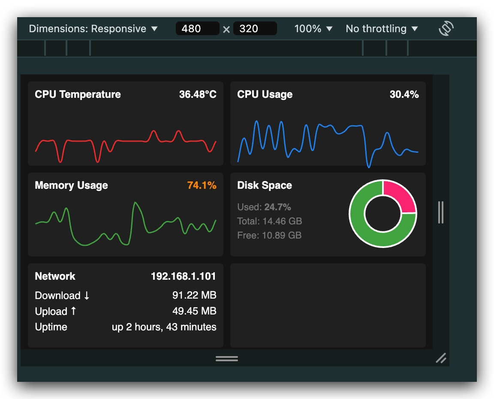

# PicoView Raspberry Dashboard

A compact system monitoring dashboard for Raspberry Pi 3B with 3.5" LCD , build with PHP

A lightweight system monitoring dashboard designed specifically for the Raspberry Pi 3B with a 3.5-inch XPT2046 Resistive Touch Screen IPS LCD (480x320).



## Hardware Requirements

- Raspberry Pi 3B
- 3.5-inch Resistive Touch Screen IPS LCD
  - Resolution: 480x320 pixels
  - Controller: XPT2046
  - Interface: SPI
  - Driver: LCD-show

## Screen Setup

### 1. Install LCD Driver

```bash
git clone https://github.com/goodtft/LCD-show.git
chmod -R 755 LCD-show
cd LCD-show/
```

### 2. Install XPT2046 Touch Screen Driver

```bash
sudo ./LCD35-show
```

After installation, the system will automatically reboot. The screen should be properly oriented in 480x320 resolution.

### 3. Touch Screen Calibration

If needed, calibrate the touch screen:

```bash
sudo TSLIB_FBDEVICE=/dev/fb1 TSLIB_TSDEVICE=/dev/input/event0 ts_calibrate
```

## Software Requirements

- PHP 7.4+
- Web Server (Apache/Nginx)
- Modern web browser

## Features

- Real-time system monitoring:
  - CPU Temperature
  - CPU Usage
  - Memory Usage
  - Disk Space
  - Network Statistics
- Responsive design optimized for 480x320 display
- Auto-refresh every 3 seconds
- Warning indicators for critical metrics
- Historical data visualization
- Network information display

## Installation

1. Clone the repository:
```bash
git clone https://github.com/yourusername/picoview.git
cd picoview
```

2. Set up web server permissions:
```bash
sudo chown -R www-data:www-data /var/www/html/pi-monitor
sudo chmod -R 755 /var/www/html/pi-monitor
```

3. Ensure PHP has necessary permissions:
```bash
sudo usermod -a -G video www-data
sudo usermod -a -G gpio www-data
```

## File Structure

- `index.html` - Main dashboard interface
- `metrics.php` - Backend API for system metrics
- `data.json` - Historical metrics storage

## Display Configuration

The dashboard is specifically designed for the 3.5-inch display:
- Resolution: 480x320 pixels
- Viewport settings:
```html
<meta name="viewport" content="width=480, initial-scale=1">
```
- Grid layout optimized for small screen
- Touch-friendly interface elements

## Auto-start Setup

To make the dashboard start automatically on boot:

1. Create a startup script:
```bash
sudo nano /etc/xdg/autostart/dashboard.desktop
```

2. Add the following content:
```ini
[Desktop Entry]
Type=Application
Name=Pi Monitor
Exec=chromium-browser --kiosk --incognito http://localhost/pi-monitor
```

## Security Considerations

- Ensure proper file permissions
- Restrict access to metrics.php
- Consider implementing authentication if exposed to network
- Monitor system resource usage

## Troubleshooting

### Screen Issues
- If screen appears rotated:
  ```bash
  sudo nano /boot/config.txt
  ```
  Add/modify:
  ```
  display_rotate=0
  ```

- For touch calibration issues:
  ```bash
  sudo TSLIB_FBDEVICE=/dev/fb1 TSLIB_TSDEVICE=/dev/input/event0 ts_test
  ```

### Performance
- Adjust refresh rate in index.html if needed
- Monitor CPU usage impact
- Consider reducing historical data points

## Contributing

1. Fork the repository
2. Create your feature branch
3. Submit pull request

## License

This project is licensed under the MIT License - see the LICENSE file for details.

## Acknowledgments

- Chart.js for visualization
- XPT2046 driver maintainers
- Raspberry Pi community
